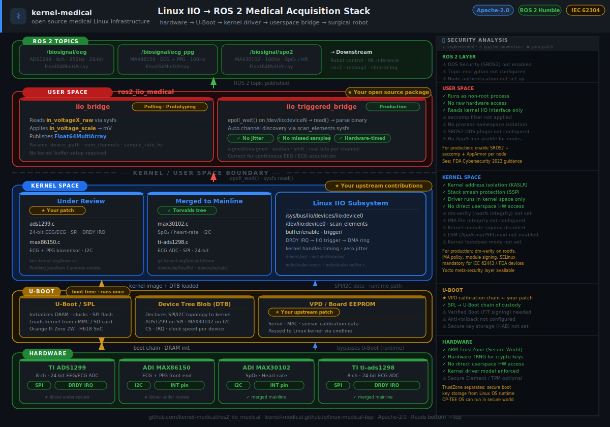

# ros2_iio_medical

ROS 2 bridge between Linux IIO biosignal kernel drivers and ROS 2 topics,
targeting medical robotics and surgical monitoring applications.



Covers the full acquisition stack — from analog sensor through Linux kernel
driver, IIO subsystem, and DMA ring buffer, up to typed ROS 2 topics ready
for robot control, ML inference, and clinical logging.

## Supported Devices

| Chip | Signal | Channels | Topic |
|---|---|---|---|
| TI ADS1299 | EEG / ECG | 8 × 24-bit | `/biosignal/eeg` |
| ADI MAX86150 | ECG + PPG | 2 | `/biosignal/ecg_ppg` |
| TI ti-ads1298 | ECG | 8 × 24-bit | `/biosignal/ecg` |
| ADI MAX30102 | SpO₂ / heart-rate | 2 | `/biosignal/spo2` |

Any Linux IIO device with standard sysfs or triggered-buffer interface is supported.

## Acquisition Modes

### Polling bridge — `iio_bridge`

Reads `in_voltageX_raw` from sysfs on a ROS 2 wall timer.
Simple, no kernel buffer setup required. Good for prototyping and low-rate sensors.

```bash
ros2 launch ros2_iio_medical iio_bridge.launch.py
```

### Triggered buffer bridge — `iio_triggered_bridge`

Uses the Linux IIO kernel buffer with `epoll(7)`.
The hardware DRDY interrupt drives the ADC; the kernel fills a DMA ring buffer;
`epoll_wait()` wakes the acquisition thread exactly once per sample batch.
No timer jitter. No missed samples. Correct approach for continuous EEG/ECG.

```bash
ros2 launch ros2_iio_medical iio_triggered_bridge.launch.py
```

## Build

```bash
cd ~/ros2_ws
source /opt/ros/humble/setup.bash
colcon build --packages-select ros2_iio_medical
source install/setup.bash
```

## Test without hardware

A simulator script creates a fake ADS1299 IIO sysfs tree at `/tmp/iio_sim`
so the bridge can be exercised without physical hardware:

```bash
# Terminal 1 — start simulator (250 Hz synthetic EEG/ECG)
bash src/ros2_iio_medical/test/simulate_ads1299.sh &

# Terminal 2 — run bridge against fake sysfs
ros2 run ros2_iio_medical iio_bridge \
  --ros-args \
  -p device_path:=/tmp/iio_sim/iio:device0 \
  -p num_channels:=8 \
  -p sample_rate_hz:=10.0 \
  -p topic_name:=/biosignal/eeg

# Terminal 3 — verify output
ros2 topic echo /biosignal/eeg
```

## Parameters

### iio_bridge

| Parameter | Default | Description |
|---|---|---|
| `device_path` | `/sys/bus/iio/devices/iio:device0` | IIO sysfs path |
| `num_channels` | `8` | Number of channels |
| `sample_rate_hz` | `250.0` | Polling rate |
| `topic_name` | `/biosignal/ecg` | Output topic |

### iio_triggered_bridge

| Parameter | Default | Description |
|---|---|---|
| `sysfs_path` | `/sys/bus/iio/devices/iio:device0` | IIO sysfs path |
| `dev_path` | `/dev/iio:device0` | IIO character device |
| `num_channels` | `8` | Number of channels |
| `buffer_length` | `64` | Kernel buffer depth in samples |
| `topic_name` | `/biosignal/eeg` | Output topic |

## Related kernel driver work

This package is the userspace counterpart to upstream Linux IIO driver
contributions for the same devices:

- **ADS1299** — 24-bit 8-channel EEG/ECG ADC, new driver under upstream review
- **MAX86150** — ECG + PPG analog front-end, new driver under upstream review
- **ti-ads1298** — ECG ADC, fixes merged to mainline Linux

The IIO subsystem presents each device through a uniform sysfs and character
device interface; this bridge reads that interface without any device-specific
code, so it works with any compliant IIO driver.

## License

Apache-2.0 — see [LICENSE](LICENSE).
